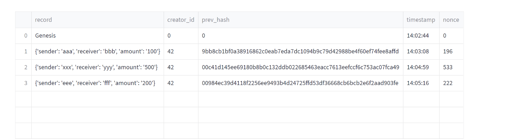
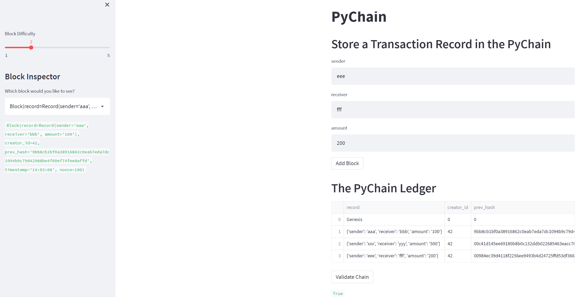

# PyChain-Ledger

In this assignment, I made the following updates to the provided Python file, which already contains the basic `PyChain` ledger structure:

1. Create a new data class named `Record`. This class will serve as the blueprint for the financial transaction records that the blocks of the ledger will store.

2. Modify the existing `Block` data class to store `Record` data.

3. Add Relevant User Inputs to the Streamlit interface.

4. Test the PyChain Ledger by Storing Records.

        In streamlit application, enter values for the sender, receiver, and amount, and then click the Add Block button. Do this several times to store several blocks in the ledger. In the Streamlit dropdown menu, we can see the block contents and hashes for selected block. We also can validate the blockchain by clicking "validate chain" button.

